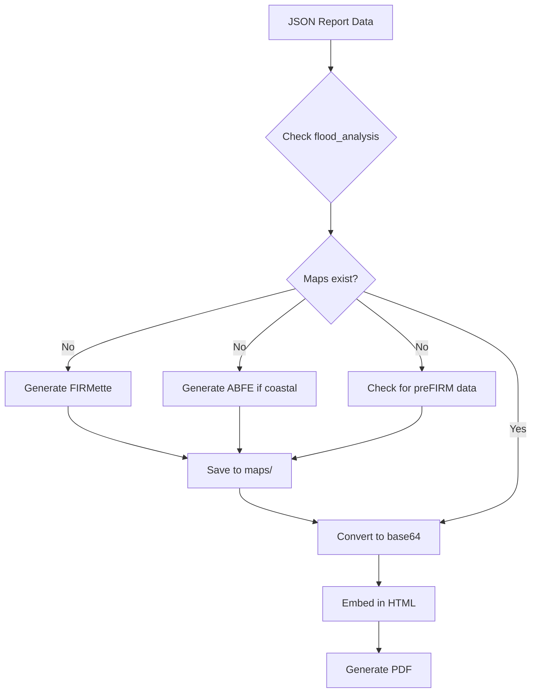

# HTML-to-PDF Integration with Comprehensive Flood Map Support

## Overview

The comprehensive screening report tool now features full HTML-to-PDF integration with automatic flood map generation support. This enhancement ensures that all environmental screening reports include properly embedded maps for FIRMette, preFIRM, and ABFE (Advisory Base Flood Elevation) data.

## Key Features

### 1. **Professional HTML-Based PDF Generation**
- Uses Jinja2 templates for sophisticated report formatting
- Includes color-coded compliance checklist (Green/Yellow/Red)
- Embeds maps directly in the PDF for each environmental section
- Professional layout suitable for regulatory submission

### 2. **Enhanced Flood Map Support**
The system now handles multiple flood map types:

#### FIRMette Maps
- Automatically generated using FEMA's FIRMette service
- Shows current effective FIRM data
- Embedded directly in the flood analysis section

#### Preliminary FIRM (preFIRM) Maps
- Generated when preliminary data is available
- Shows proposed changes to flood zones
- Helps identify future regulatory changes

#### ABFE Maps
- Generated for coastal areas with advisory data
- Shows Advisory Base Flood Elevations
- Critical for post-disaster recovery planning

### 3. **Intelligent Map Detection and Generation**

The system follows this workflow:

1. **Check Existing Maps**: First looks for existing map files in the project
2. **Generate Missing Maps**: Automatically generates missing flood maps using:
   - `FloodINFO.firmette_client` for FIRMette generation
   - `FloodINFO.abfe_client` for ABFE map generation
3. **Format Optimization**: Prefers PNG format for better HTML embedding
4. **Base64 Encoding**: Converts maps to base64 for direct HTML embedding

### 4. **Map Format Preferences**

The system intelligently handles different map formats:
- **PNG**: Preferred format for HTML embedding (direct support)
- **PDF**: Automatically converted to PNG when `pdf2image` is available
- **Fallback**: Uses original format if conversion fails

## Usage

### Basic Usage

```python
from comprehensive_screening_report_tool import generate_comprehensive_screening_report

# Generate report with professional HTML PDF
result = generate_comprehensive_screening_report(
    output_directory="output/YourScreeningProject",
    output_format="both",
    include_pdf=True,
    use_professional_html_pdf=True,  # Enable HTML-to-PDF
    use_llm=True  # Optional: Enable AI enhancement
)
```

### Command Line Usage

```bash
# Generate report for a specific directory
python comprehensive_screening_report_tool.py output/YourProject

# With professional HTML PDF (default)
python comprehensive_screening_report_tool.py output/YourProject --format both

# Auto-discover and process all projects
python comprehensive_screening_report_tool.py --auto-discover
```

### Testing the Integration

```bash
# Run the test script
python test_html_pdf_integration.py

# Or test with a specific directory
python test_html_pdf_integration.py output/YourProject
```

## Configuration

### Environment Variables

Configure map generation preferences:

```python
import os

# Configure for PNG output (better for HTML embedding)
os.environ['SCREENING_MAP_FORMAT'] = 'PNG'
os.environ['PREFER_PNG_MAPS'] = 'TRUE'
```

### Tool Configuration

The tool automatically configures for optimal output when using HTML PDF:

```python
# This happens automatically when use_professional_html_pdf=True
ScreeningReportTool.configure_for_png_output()
```

## HTML Template Updates

The `environmental_report_template.html` now includes:

### Multiple Flood Map Sections

```html
<!-- FIRMette Map -->

<div class="map-container">
    <div class="subsection-header">FIRMette Map</div>
    
    <div class="map-caption">FEMA Flood Insurance Rate Map (FIRMette)</div>
</div>


<!-- Preliminary FIRM Map -->

<div class="map-container">
    <div class="subsection-header">Preliminary FIRM Map</div>
    
    <div class="map-caption">FEMA Preliminary Flood Insurance Rate Map</div>
</div>


<!-- ABFE Map -->

<div class="map-container">
    <div class="subsection-header">Advisory Base Flood Elevation (ABFE) Map</div>
    
    <div class="map-caption">FEMA Advisory Base Flood Elevation Map</div>
</div>

```

## Dependencies

### Required
- `jinja2`: HTML templating
- `weasyprint`: HTML to PDF conversion (recommended)

### Optional
- `pdf2image`: PDF to PNG conversion for better embedding
- `PyMuPDF`: Alternative PDF processing
- `reportlab`: Fallback PDF generation

### Installation

```bash
# Basic HTML PDF support
pip install jinja2 weasyprint

# Full support with PDF-to-image conversion
pip install jinja2 weasyprint pdf2image

# All features
pip install jinja2 weasyprint pdf2image PyMuPDF pillow
```

## Map Generation Flow



## Troubleshooting

### Common Issues

1. **PDF Generation Fails**
   - Ensure `weasyprint` is installed: `pip install weasyprint`
   - Check system dependencies for WeasyPrint

2. **Maps Not Embedding**
   - Verify map files exist in the `maps/` directory
   - Check that `pdf2image` is installed for PDF map conversion
   - Ensure proper file permissions

3. **Flood Maps Not Generating**
   - Verify FloodINFO modules are available
   - Check internet connection for FEMA services
   - Ensure valid coordinates in the project data

### Debug Mode

Enable detailed logging:

```python
import logging
logging.basicConfig(level=logging.DEBUG)
```

## Best Practices

1. **Map Format**: Generate maps as PNG when possible for better embedding
2. **File Size**: Keep individual maps under 5MB for optimal performance
3. **Resolution**: Use 300 DPI for print-quality PDFs
4. **Caching**: Reuse existing maps when regenerating reports

## Future Enhancements

1. **Batch Map Generation**: Pre-generate all maps before report creation
2. **Map Caching**: Cache generated maps for reuse
3. **Custom Map Styles**: Allow customization of map appearance
4. **Interactive Maps**: Support for interactive HTML reports

## API Changes

### New Parameters

- `use_professional_html_pdf`: Enable HTML-based PDF generation (default: True)
- `prefer_png_maps`: Prefer PNG format for map embedding (default: True)

### New Methods

- `_generate_missing_flood_maps()`: Automatically generates missing flood maps
- `_resolve_map_paths()`: Enhanced to handle multiple flood map types
- `configure_for_png_output()`: Configures tools for PNG map generation

## Example Output

The generated PDF includes:

1. **Professional Header**: Project name, date, location
2. **Executive Summary**: Key findings and risk assessment
3. **Compliance Checklist**: Color-coded status for each factor
4. **Detailed Analysis Sections**: Each with embedded maps
   - Property & Cadastral Analysis
   - Karst Analysis (PR specific)
   - **Flood Analysis** (with FIRMette, preFIRM, ABFE maps)
   - Wetland Analysis
   - Critical Habitat Analysis
   - Air Quality Analysis
5. **Recommendations**: Actionable next steps
6. **Appendices**: File inventory and references

## Conclusion

The HTML-to-PDF integration with comprehensive flood map support provides a complete solution for generating professional environmental screening reports. The system automatically handles map generation, format conversion, and embedding, ensuring that all reports include the necessary visual documentation for regulatory compliance and decision-making. 